# Planary — 생각을 정리하는 워크스페이스

> 할 일, 위키, 포스트잇, 프로젝트를 한 곳에서. 조용하고 단정하게 하루를 정리하세요.

**🌐 라이브 데모:** [planary-a2f6b.web.app](https://planary-a2f6b.web.app/)&nbsp;&nbsp;|&nbsp;&nbsp;**📦 레포지토리:** [github.com/yoobinkim541/plannary_smart_planner](https://github.com/yoobinkim541/plannary_smart_planner)

---

## 프로젝트 개요

Planary는 Notion에서 영감을 받아 직접 설계·개발한 **올인원 생산성 웹앱**입니다. 단순한 할 일 목록을 넘어 블록 기반 위키 에디터, 포스트잇 보드, 프로젝트 트래커, 북마크 관리까지 실제 서비스 수준의 기능을 갖추고 있습니다.

바닐라 JS로 시작해 React 기반 리디자인까지 진행한 **전체 프론트엔드 풀사이클 프로젝트**로, Firebase와의 실시간 연동, PWA 오프라인 지원, 다국어(5개 언어), 모바일 반응형 UI를 모두 직접 구현했습니다.

- **개발 기간**: 2025년 1월 ~ 현재 (진행 중)
- **커밋 수**: 574+
- **총 PR 수**: 121+
- **개발 형태**: 1인 풀스택 개발

---

## 핵심 기능

### 작업 관리 (Task Suite)
- 빠른 입력창(Quick Capture)으로 즉시 작업 추가 — 입력 후 포커스 자동 복귀
- 우선순위(High/Med/Low), 마감일, 태그, 프로젝트 연결 지원
- **오늘 / 연체 / 중요 / 리마인더 / 완료** 탭 필터링
- 칸반(Kanban) 뷰 · 그룹 뷰 전환
- 포커스 모드 — 하나의 작업에 집중하는 전체화면 타이머 오버레이
- ⌘K 커맨드 팔레트로 페이지 이동·포커스 모드 진입

### 블록 기반 위키 에디터 (Notion-style)
- 16가지 블록 타입: 제목 1/2/3, 본문, 인용, 콜아웃, 코드, **수식(KaTeX)**, 표, 이미지, 파일, 북마크, 체크리스트, 글머리, 번호 매기기, 구분선, 할 일
- `/` 슬래시 커맨드로 블록 타입 즉시 전환
- **드래그 앤 드롭** 블록 정렬 (데스크탑) + **위로/아래로 이동** 버튼 (모바일)
- 인라인 수식(`$...$`) 렌더링 — 포커스 시 소스 전환, 블러 시 렌더링
- **체크리스트 전체 완료 시 축하 토스트** 자동 발생
- 페이지 트리 (무한 중첩 하위 페이지), 버전 히스토리, 페이지 복제
- **Markdown 실제 내보내기** — 블록 구조를 `.md` 파일로 변환 다운로드
- 즐겨찾기 → 사이드바에 자동 반영 (localStorage 동기화)

### 포스트잇 보드 (Notes)
- 자유 배치 드래그 앤 드롭 — 좌표를 Firestore에 저장하여 레이아웃 유지
- 7가지 색상 테마, 복제, 자유 리사이즈
- 최대 1,500자 제한으로 Firestore 문서 크기 보호

### 프로젝트 트래커
- 프로젝트별 작업 묶기, 진척률(%) 자동 계산 링 차트
- 프로젝트 삭제 시 연관 작업의 `projectId` 배치 초기화 (데이터 정합성)
- e-Class 강의 일정 자동 동기화 (학교 LMS 연동)

### 북마크
- URL 자동 스킴 보정 (`example.com` → `https://example.com`)
- 유효하지 않은 URL 저장 차단
- 빈 상태 가이드 UI

### 보관함 (Archive)
- 완료 작업 보관 및 복원 (호버 복원 버튼)
- **CSV 실제 다운로드** — 제목·완료일·우선순위·프로젝트·메모 포함, BOM 처리로 Excel 한글 호환

---

## 기술 스택

| 영역 | 기술 |
|---|---|
| **프론트엔드** | React 18.3 (CDN UMD), Babel Standalone, Vanilla JS |
| **스타일링** | CSS Custom Properties (디자인 토큰), `color-mix()`, 반응형 Grid/Flex |
| **백엔드** | Firebase Firestore v10, Firebase Auth, Firebase Storage |
| **인프라** | Firebase Hosting, Vercel, GitHub Actions |
| **PWA** | Service Worker (Cache API v162), Web App Manifest |
| **수식** | KaTeX 0.16 (블록/인라인) |
| **i18n** | 자체 구현 다국어 시스템 (한/영/일/중/스페인어, 5개 언어) |
| **보안** | Firestore Security Rules, SRI (Subresource Integrity) |

---

## 아키텍처

```
planary/
├── redesign/                   # React 기반 메인 앱 (현재 서비스)
│   └── src/
│       ├── app.jsx             # 최상위 레이아웃, 커맨드 팔레트, 전역 이벤트 버스
│       ├── components.jsx      # 사이드바, 탑바, 토스트, 공통 UI
│       ├── pages-home-tasks.jsx # 홈 대시보드, 작업 목록, 퀵 캡처
│       ├── pages-rest.jsx      # 위키, 프로젝트, 노트, 북마크, 보관함, 프로필
│       ├── firebase-bridge.jsx # Firestore·Auth 이벤트 브릿지 (커스텀 이벤트 버스)
│       ├── i18n.jsx            # 다국어 런타임
│       ├── icons.jsx           # 인라인 SVG 아이콘 시스템
│       └── tokens.css          # 디자인 토큰 (색상, 타이포, 간격)
├── sw.js                       # Service Worker (Cache v162, 오프라인 지원)
├── firestore.rules             # Firestore 보안 규칙
└── index.html / app.js         # 레거시 바닐라 JS 버전 (보존)
```

**이벤트 버스 패턴**: React 컴포넌트와 Firebase 브릿지 사이를 `window.dispatchEvent` 커스텀 이벤트로 연결합니다. 상태는 React 내부에서 관리하고 Firestore 작업은 브릿지가 단독으로 담당해 관심사를 분리했습니다.

---

## 주요 구현 포인트

### 실시간 데이터 동기화
Firestore `onSnapshot`으로 구독하여 다중 탭·기기에서 데이터가 실시간으로 반영됩니다. 낙관적 업데이트(Optimistic Update)를 적용해 UI 응답이 Firestore 왕복을 기다리지 않습니다.

### PWA & 오프라인 지원
Service Worker가 앱 셸 에셋을 캐시하여 네트워크 없이도 앱을 로드합니다. 로그아웃 시 `postMessage`로 SW 캐시를 전체 삭제해 공유 기기에서의 개인정보를 보호합니다.

### 보안
- Firestore 규칙으로 `uid`가 일치하는 문서만 읽기/쓰기 가능
- 계정 삭제 순서: Auth 먼저 삭제 → 데이터 삭제 (역순 시 재인증 실패로 데이터 손실 위험)
- 로그아웃 시 localStorage 민감 키 초기화 + SW 캐시 삭제
- CDN 스크립트 SRI(Subresource Integrity) 해시 적용

### 다국어 시스템
빌드 도구 없이 런타임에 언어를 전환하는 자체 i18n 시스템을 구현했습니다. React Context를 활용해 언어 변경 시 전체 UI가 즉시 재렌더링됩니다.

---

## 스크린샷

> 라이브로 직접 써보세요 → [planary-a2f6b.web.app](https://planary-a2f6b.web.app/)

### 홈 대시보드

오늘 할 일·이번 주 캘린더·프로젝트 진척률·최근 메모·다가오는 리마인더를 한 화면에 모았습니다.

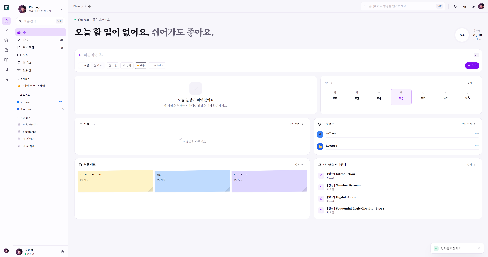

### 핵심 기능

| 위키 에디터 | 포스트잇 보드 | 프로젝트 + e-Class 연동 |
|:--:|:--:|:--:|
| 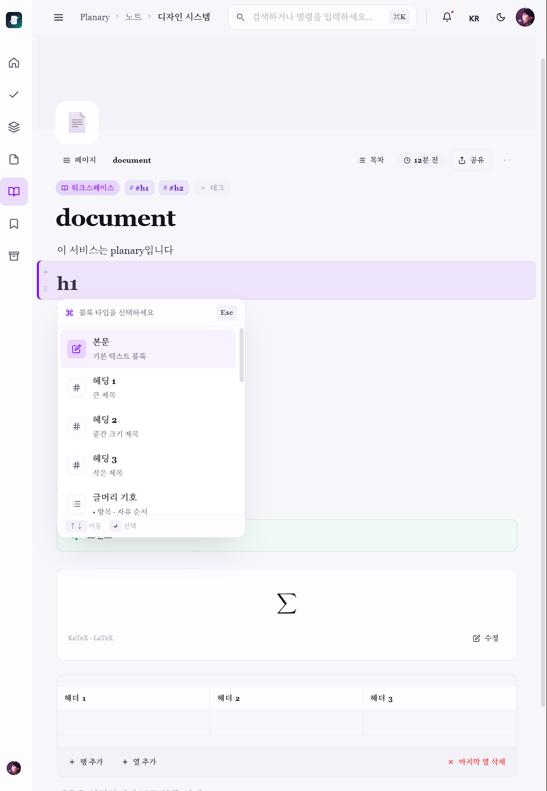 | 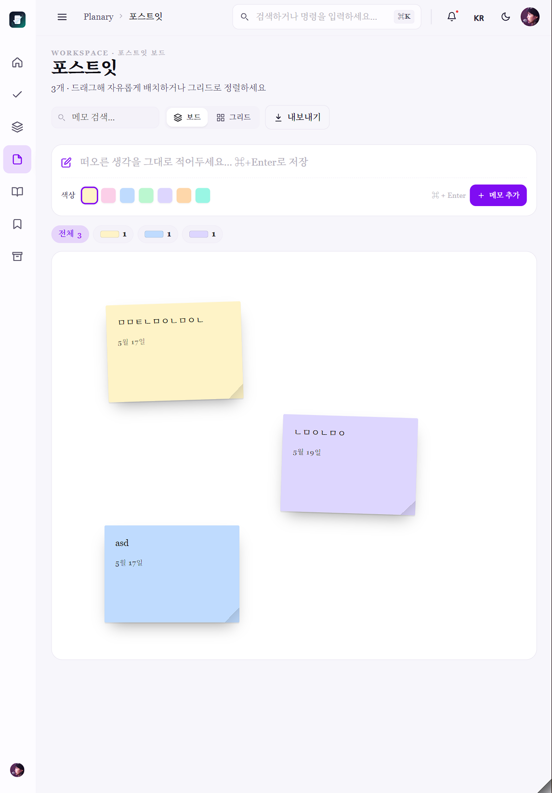 | 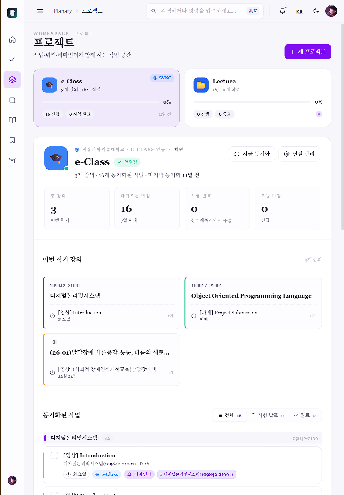 |
| 슬래시 커맨드 · KaTeX 수식 · 표 블록 | 자유 배치 드래그 앤 드롭 | 학교 LMS 강의·과제 자동 동기화 |

| 작업 관리 | 포커스 모드 | 보관함 · 활동 히트맵 |
|:--:|:--:|:--:|
| 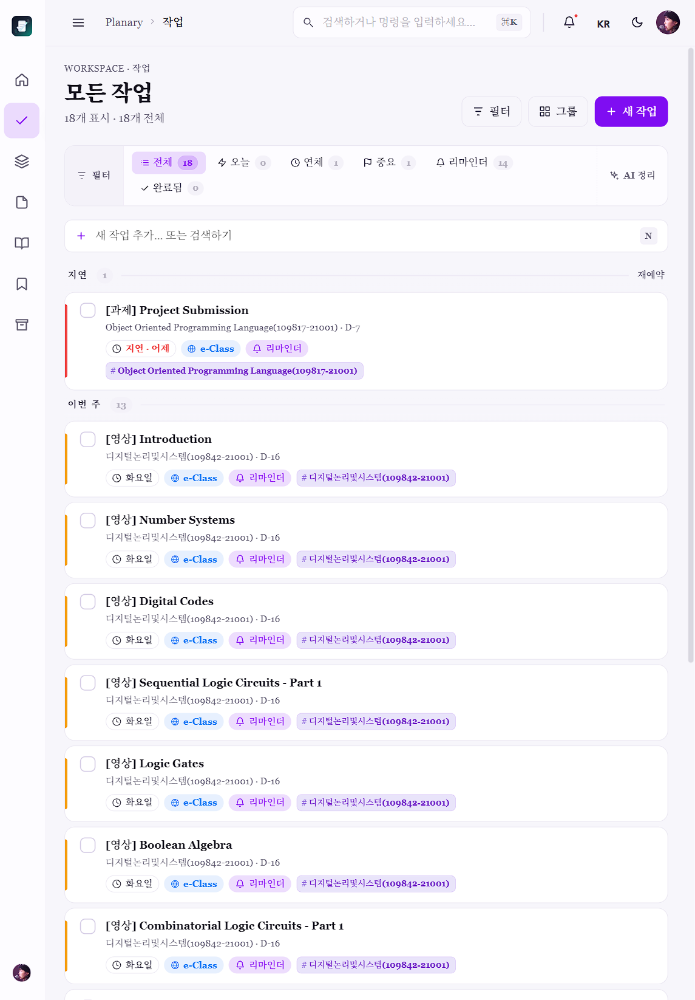 | 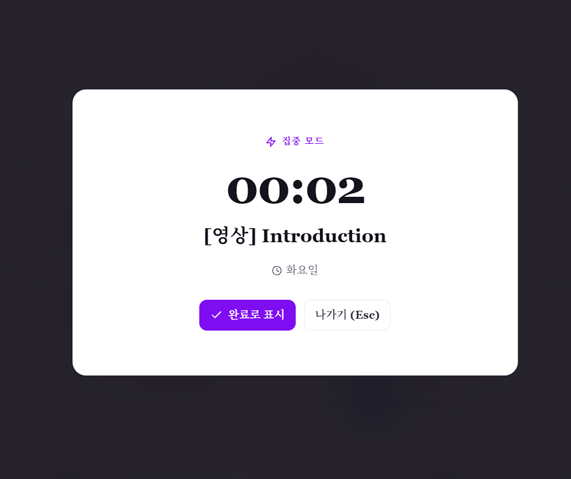 | 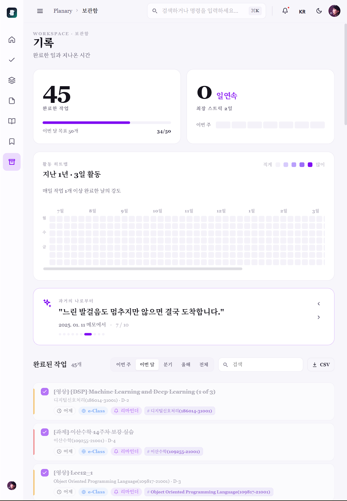 |
| 우선순위 · 기한 · 프로젝트 필터 | 단일 작업 집중 타이머 오버레이 | 완료 통계 · CSV 내보내기 |

### 반응형 · 다크 모드 · 다국어

| 태블릿 | 모바일 | 다크 모드 | 다국어 (5개 언어) |
|:--:|:--:|:--:|:--:|
| 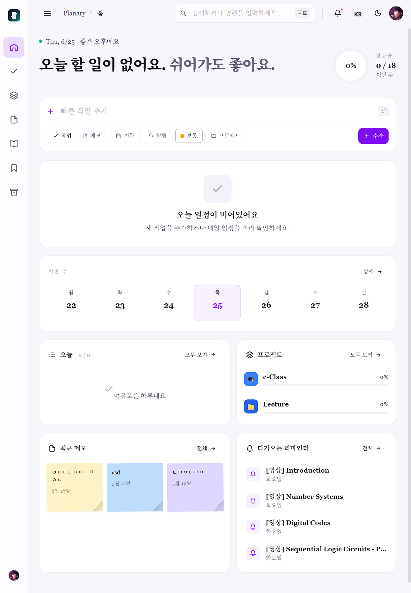 | 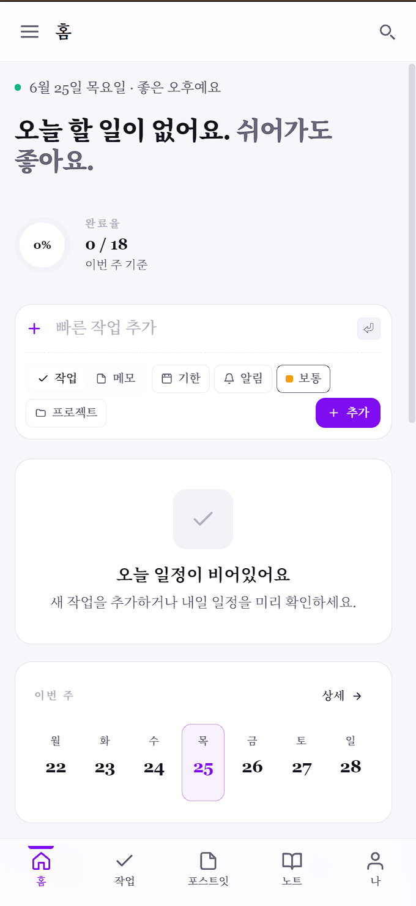 | 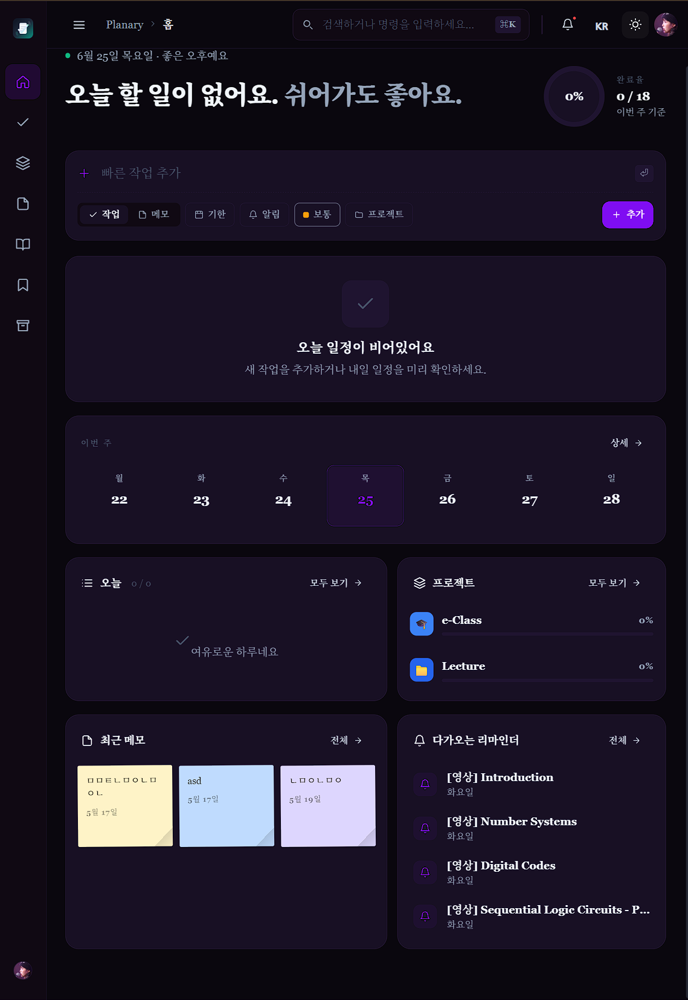 | 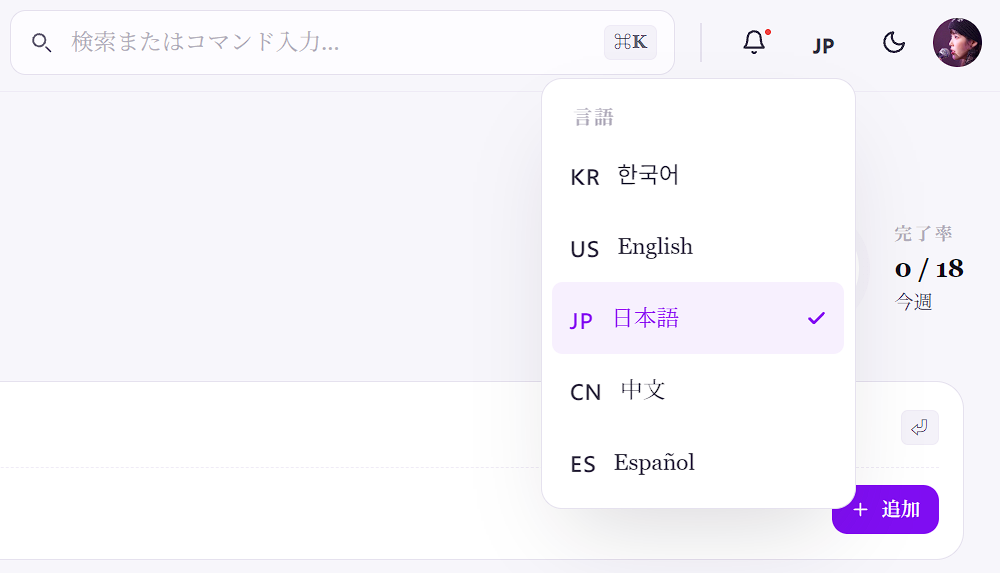 |
| 좁은 폭 자동 단 조정 | 하단 탭바 모바일 UI | 라이트/다크 테마 | 한·영·일·중·스페인어 |

<details>
<summary><b>설정 &amp; 통계 화면 더 보기</b></summary>

<br>

| 프로필 · 활동 요약 | 위젯 · 캘린더 연동 | 외관 · 보안 |
|:--:|:--:|:--:|
| 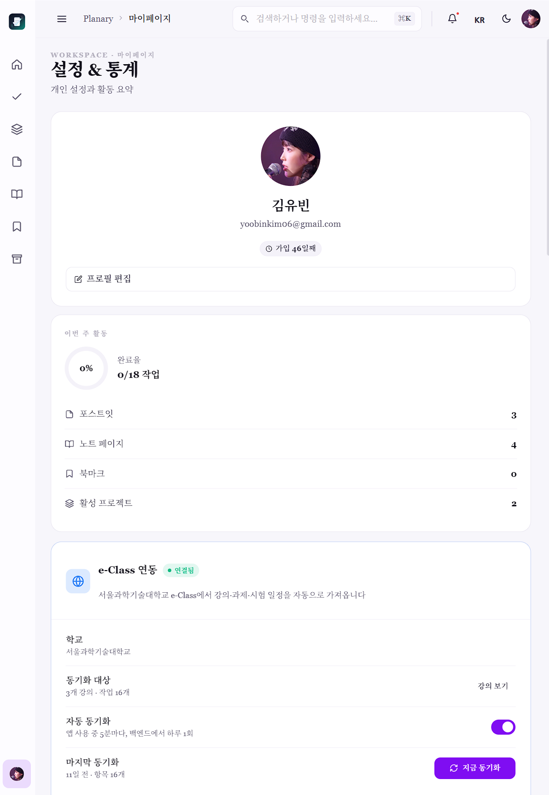 | 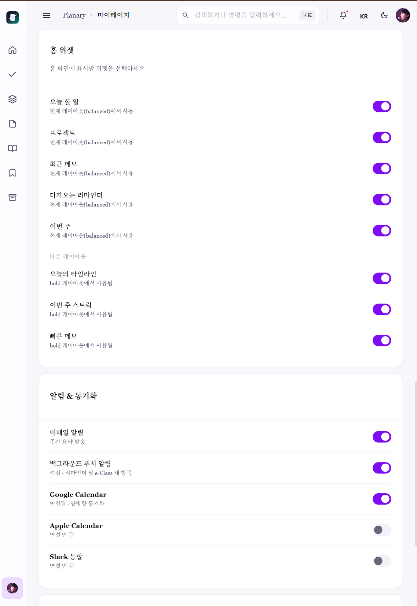 | 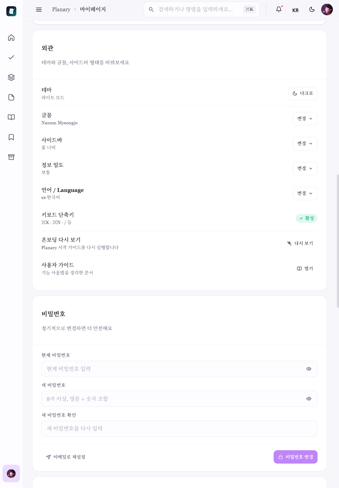 |

</details>

---

## 로컬 실행

```bash
git clone https://github.com/yoobinkim541/plannary_smart_planner.git
cd plannary_smart_planner
npx serve .
# → http://localhost:3000/redesign/
```

Firebase 연동이 필요합니다. `firebase-init.js`에 본인의 Firebase 프로젝트 설정을 입력하세요.

---

## 개발 과정에서 해결한 문제들

| 문제 | 해결 |
|---|---|
| 빌드 도구 없는 React JSX 환경에서의 상태 관리 | 커스텀 훅(`useStateO`, `useEffectO`) + 이벤트 버스 패턴 |
| 다중 탭 실시간 충돌 | Firestore `onSnapshot` + 낙관적 업데이트 |
| 모바일에서 HTML5 드래그 미지원 | 블록 컨텍스트 메뉴에 위로/아래로 이동 버튼 추가 |
| 프로젝트 삭제 시 작업 참조 오염 | 삭제 전 배치 쿼리로 연관 작업 `projectId` 일괄 초기화 |
| 계정 삭제 레이스 컨디션 | Auth 먼저 삭제 후 서버 데이터 삭제로 순서 보장 |
| 로그아웃 후 캐시 잔류 | SW `postMessage`로 전체 캐시 삭제 |
| Export 기능이 stub으로 구현됨 | 블록 구조를 Markdown 문법으로 변환하는 실제 내보내기 구현 |

---

## 향후 계획

- [ ] Oracle Cloud 서버 마이그레이션 + REST API 구축
- [ ] Obsidian 플러그인 연동 (양방향 Markdown 동기화)
- [ ] Firebase Storage 기반 이미지/파일 업로드 (현재 base64)
- [ ] 협업 기능 (문서 공유, 댓글)

---

*개인 생산성 도구가 필요해서 만들기 시작했고, 직접 쓰면서 계속 개선하고 있습니다.*
